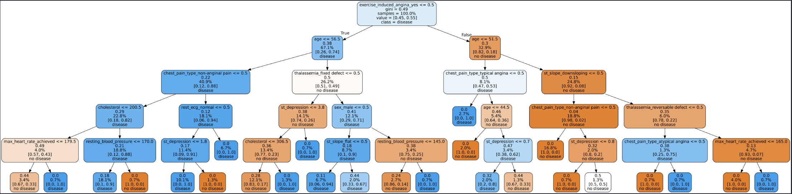

# Series Spring Project

## Motivation / Background

- 

## Research Questions / Objectives

- 

## Results / Outcomes 

1. Design that easily assemble springs in series

2. 

# Library Generalization for Open-Source Leg

## Motivation / Background

- The current `OSL` software library is biased with a specific hardware provider `Dephy`. 

- A user-friendly, generalized version of the software library is needed so that it is neutral to any hardware provider instead of biased, to provide an opportunity for [low-cost alternatives / Open-Source/collaborations]. 

## Research Questions / Objectives

1. A generalized, user-friendly version of the `OSL` library that is neutral to various hardware alternatives. 

2. BLDC motor controller alternative with [performance evaluation/test], for user reference. 

## Results / Outcomes 

1. Design / Implementation of a finite state machine that performs mode transition systematically

[Picture of `State Machine`]

2. New Structure of base library

3. Evaluate alternative controllers through Step Responses [`Time Domain Specifications`]

# Development of Robot Swimmer Model

## Motivation / Background

- Targeting Transport is an emerging field in the medical industry to obtain a more precise cure for the diseased area. This transport process requires a robot transporter to reach the target.

- Traditional methods made designs of robot transporters less effective in targeting transport, which motivates me to put forward advanced designs and apply a more effective control strategy

## Research Question / Objective

This design aims to:

- design the mechanical features of the swimming robot and validate the design with simulations
- develop a control model for the robot's path planning, trajectory tracking, and automatic error correction
- offer a feasible solution for future research in controlling Robot-Swimmer motions 

## Results / Outcomes

1. A robot **model** with sphere head and quad flegella

2. Feedback Control Systems for Robot's Locomotion Control

3. Path Planning Model for Robot's Navigation, and Evaluation of Tracking Behavior [Reference tracking result]

# Automated Vehicle with Tracking System

## Motivation

## Research Question / Objective

- Make the process of fetching objects unmanned and efficient. 

## Results

1. A camera module that recognizes a corresponding object (a tennis ball) and measures its approximate distance from the camera, through YOLO-V3. 

2. A Gimbal Stabilizer that holds the camera module and performs object tracking

# Clinical Data Analysis

## Motivation

- AI's reference is needed for a quicker, more precise diagnostics, so that prevention / effective therapy of curing common heart diseases is applied timely. 

## Research Questions / Objectives

- Develop a classification model (based on `random forest` model) to do quick and precise classification of common heart diseases by causes (e.g. age, chest pain type, etc)

- Optimize the model to be interpretable and precise in classifications [by `Interpretability analysis`]

## Results

- Random Forest Model to classify heart diseases

- Evaluation of Model Performance (Confusion Matrix, Feature Importance evaluated by SHAPLEY values)

